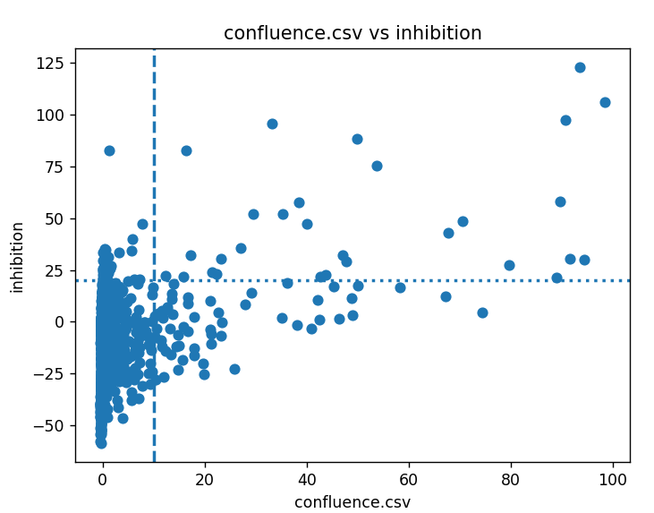
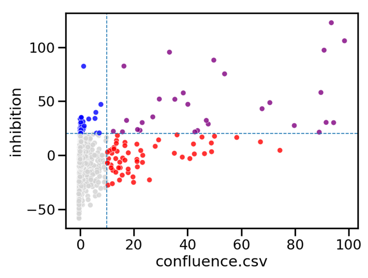
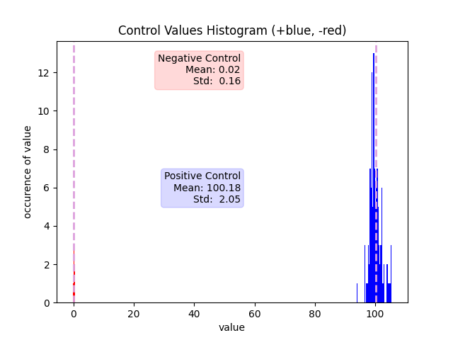
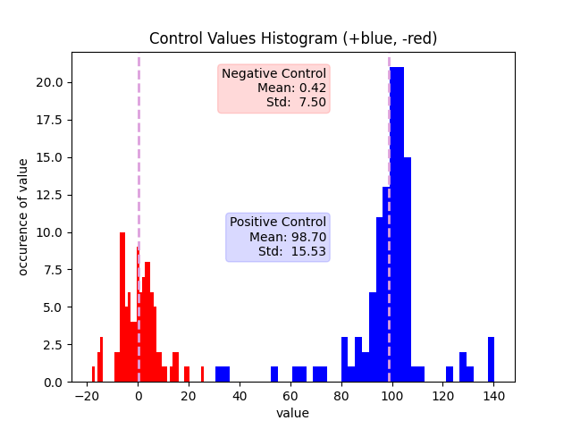
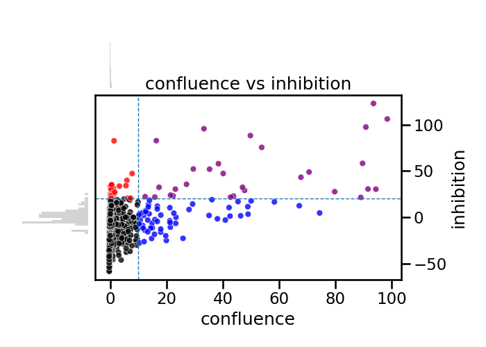
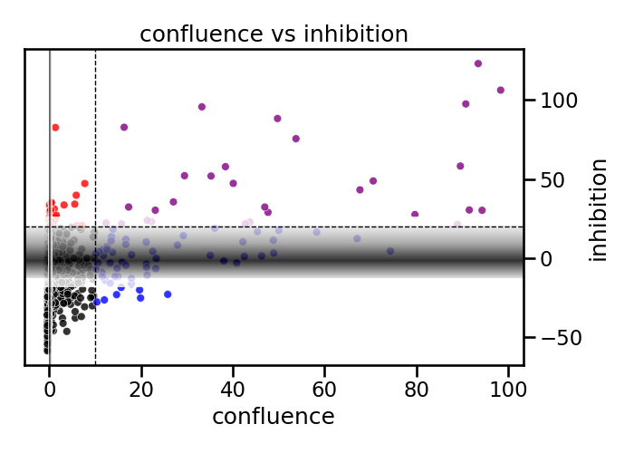

# multi-assay-activity-analysis
Dual-assay analysis of EU-OPENSCREEN data to compare biological readouts and identify misleading or assay-specific activity signals

## Overview
This project analyses two biological assay readouts (confluence and inhibition) from the EU-OPENSCREEN dataset (EOS300008, https://ecbd.eu/assays/EOS300008#scroll-nav__5) 

## Dataset
~2400 compounds tested at 10 µM on cells infected with a virus (which affects cell count by killing and cell morphology by harming cells). Tested in 384 well plates with positive and negative controls on each plate. 

- Two assay readouts:
  - Confluence (cell area)
  - Inhibition (cell count)
- Activity defined as:
  - Confluence >10% OR Inhibition >20%
  

## Objectives
-	Identify the most potent compounds (perform well in both readouts)
- Identify other compounds of interest (differ from any trends, perform well in one readout but not the other)
- Evaluate how control variability affects interpretation
- Look for trends between the two readouts

## Key Findings
### 1. 3 compounds perform very well (>80%) in both readouts:
•	These are lead candidates
### 2. Some compounds perform well in the confluence readout but not the inhibition readout:
•	This implies that many cells died, but those remaining had normal morphology.
•	How? 
o	Further Experiments: test with uninfected cells to see if the compounds themselves reduce cell count without affecting morphology

### 3. Overlap between active compounds and control distributions
Some compounds classified as active fall within the range of negative controls, particularly in the inhibition assay, suggesting potential false positives.
### 4. Data integrity risk during dataset merging
Initial attempts to combine datasets without proper alignment would have resulted in incorrect compound comparisons, highlighting the importance of careful data integration.

## Results:
## Assay Comparison
Scatter plot of confluence vs inhibition with activity thresholds.

### Observation
There is weak correlation between the two assays. Many compounds classified as active fall into only one quadrant, indicating assay-specific behaviour. Most compounds are inactive in both assays.
## Improved Visualisation
Quadrant-coloured scatter plot highlighting assay-specific vs concordant activity.

## Control Assay Comparison
Histogram plot of the control results for the confluence assay:

Histogram plot of the control results for the inhibition assay:

### Observation
Negative controls cluster around 0% activity, while positive controls cluster near 100%, but the inhibition assay shows higher variance.
### Implication
Higher variability in inhibition increases the risk of misclassifying compounds near the activity threshold.

## Combining the control and experimental Data
Visualisations incorporating control distributions highlight overlap between experimental signals and negative controls.

Scatter plot of confluence vs inhibition with activity thresholds, with quadrant colouring, incorporating the negative control histograms as a shaded bar in the actual plot.

## Limitations
- Plate-level information is not available, preventing assessment of batch effects (did some plates overall have higher or lower inhibition values)
- Single measurements per compound limit statistical confidence

## Implications
- Compounds active in both assays represent higher-confidence candidates
- Assay-specific activity should be treated cautiously and may require orthogonal validation
- Control overlap suggests that threshold-based classification alone may be insufficient

## Next Steps
- Investigate compounds with discordant assay behaviour
- Explore concentration-response relationships
- Incorporate replicate or plate-level data if available

  
